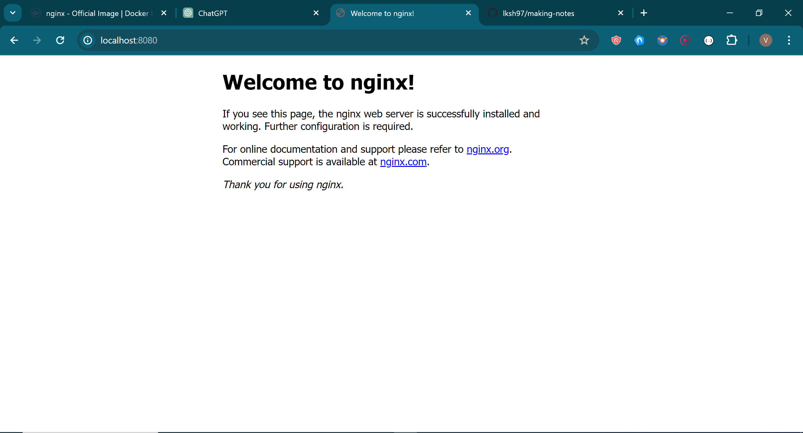
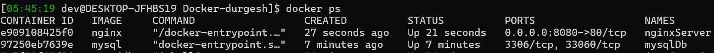

**Q1. What does pulling fs layer means in docker**

```markdown
In Docker, the term "pulling fs layer" refers to the process of downloading the filesystem layers of a Docker image from a registry. When you run a Docker container based on an image that isn't already available locally on your system, Docker needs to retrieve that image from a registry, such as Docker Hub or a private registry.

Here's what happens during the "pulling fs layer" process:

1. Docker client sends a request to the registry for the specified image.
2. The registry responds with metadata about the image, including a list of the filesystem layers that compose the image.
3. Docker client checks which layers it already has locally. It only downloads the layers that it doesn't have.
4. Each layer is downloaded individually, and Docker combines them to reconstruct the complete filesystem for the image on your local system.
5. Once all the necessary layers are downloaded, Docker creates a container using the downloaded filesystem layers.

This process is fundamental to Docker's operation, as it allows for efficient distribution and sharing of container images across different systems. Once an image is pulled and cached locally, subsequent runs of containers based on that image can be much faster, as Docker can reuse the cached layers rather than downloading them again.
```


**Q2.Explain**
 ```console
docker pull openjdk
```

```console
docker pull openjdk
Using default tag: latest
latest: Pulling from library/openjdk
197c1adcd755: Pull complete
57b698b7af4b: Pull complete
95a27dbe0150: Pull complete
Digest: sha256:9b448de897d211c9e0ec635a485650aed6e28d4eca1efbc34940560a480b3f1f
Status: Downloaded newer image for openjdk:latest
docker.io/library/openjdk:latest
```

```markdown
Certainly! Let's break down the output of the `docker pull openjdk` command:

1. `docker pull openjdk`: This command instructs Docker to pull the OpenJDK image from a registry. If the image is not already available locally, Docker will download it.

2. `Using default tag: latest`: This line indicates that Docker will pull the image tagged as "latest." In Docker, if you don't specify a tag, it defaults to "latest."

3. `latest: Pulling from library/openjdk`: Docker communicates with the Docker Hub registry and indicates that it's pulling the "latest" version of the OpenJDK image from the `library/openjdk` repository. The repository `library/openjdk` is a part of the Docker Hub's official images.

4. `197c1adcd755: Pull complete`, `57b698b7af4b: Pull complete`, `95a27dbe0150: Pull complete`: These lines represent the unique identifiers (SHA256 digests) of the image layers being pulled. Docker pulls images layer by layer, and here it's indicating that each layer has been successfully downloaded.

5. `Digest: sha256:9b448de897d211c9e0ec635a485650aed6e28d4eca1efbc34940560a480b3f1f`: This line provides the digest of the pulled image. It's a cryptographic hash that uniquely identifies the image content. It ensures the integrity of the pulled image.

6. `Status: Downloaded newer image for openjdk:latest`: This message indicates that the Docker client has successfully downloaded the newer version of the OpenJDK image tagged as "latest" from the Docker Hub registry.

7. `docker.io/library/openjdk:latest`: This line specifies the repository and tag of the pulled image. In this case, it's `library/openjdk` from the default Docker Hub registry (`docker.io`) with the "latest" tag.

In summary, the output shows the progress and status of pulling the OpenJDK image, including details like the pulled layers, image digest, and final status.
```

**Q3.Explain**
`docker search MYSQL`


```markdown
When you run the command `docker search MYSQL`, Docker searches its public registry (Docker Hub) for images related to MySQL. Here's a breakdown of the output:

1. **NAME**: This column lists the names of the Docker images found in the search.

2. **DESCRIPTION**: This column provides a brief description of each image.

3. **STARS**: This column shows the number of stars each image has received on Docker Hub. Stars are a way for users to indicate their interest or approval of an image.

4. **OFFICIAL**: This column indicates whether the image is officially maintained by the organization responsible for the software (in this case, MySQL). An `[OK]` indicates it's official.

5. **AUTOMATED**: This column indicates whether the image is built and updated automatically. An `[OK]` indicates it's automated.

Here's a summary of some of the images listed:

- **mysql**: This is the official MySQL image, widely used for running MySQL databases in Docker containers. It has received a high number of stars and is marked as official and automated.

- **percona**: This is Percona Server, a fork of MySQL. It's also marked as official and automated.

- **phpmyadmin**: This is phpMyAdmin, a web interface for managing MySQL databases.

- **mariadb**: MariaDB Server, a high-performing open-source database server, is another popular option. It's marked as official and automated.

- **bitnami/mysql**: A MySQL Docker image provided by Bitnami, a company that specializes in creating ready-to-run software stacks.

- **ubuntu/mysql**: An image that combines MySQL with Ubuntu, providing MySQL in an Ubuntu environment.

- **linuxserver/mysql**: A MySQL container provided by LinuxServer, a community-driven effort to provide containerized applications.

- **databack/mysql-backup**: An image focused on backing up MySQL databases.

These are just a few examples from the list. Depending on your specific requirements, you can choose the appropriate image for your Docker projects.
```

**Q3.Explain** `docker run --name <containerName> -d <imageId>`

```markdown
The command `docker run --name pythonContainer -d ae29c48b7429` instructs Docker to run a container in the background with the specified image ID `ae29c48b7429` and assign it the name `pythonContainer`. 

Here's a breakdown of the command:

- `docker run`: This is the command used to run a Docker container.
- `--name pythonContainer`: This option assigns a name (`pythonContainer`) to the container. Names are easier to remember and use than container IDs.
- `-d`: This option runs the container in detached mode, meaning it runs in the background and does not block the terminal.
- `ae29c48b7429`: This is the ID of the Docker image from which the container will be created.

After executing this command, Docker will start a new container in the background based on the specified image (`ae29c48b7429`) and assign it the name `pythonContainer`. You can use this name to manage the container, such as stopping or removing it later.
```

**Q4 Explain**
```console
Explain -  docker exec -it <containerId> python3
```

```markdown
The command `docker exec -it <containerId> python3` is used to execute a command (`python3` in this case) inside a running Docker container. Let's break down the components of this command:

- **`docker exec`**: This is the Docker command used to execute a command inside a container.

- **`-it`**: These options combined (`-i` for interactive and `-t` for allocating a pseudo-TTY) make the execution interactive, allowing you to interact with the command being executed. It ensures that you can enter input into the command and receive output from it.

- **`<containerId>`**: This is the unique identifier (Container ID) of the Docker container in which you want to execute the command. You can find the Container ID by running `docker ps`.

- **`python3`**: This is the command that you want to execute inside the container. In this case, it's running Python 3 interpreter.

When you run `docker exec -it <containerId> python3`, Docker will:

1. Find the running container with the specified Container ID.
2. Attach to the container's running process.
3. Start a new instance of Python 3 interpreter inside the container.
4. Allocate a pseudo-TTY and allow you to interact with the Python interpreter as if you were running it directly on your local machine.

This command is useful for various tasks, such as debugging, running scripts, or interacting with applications running inside Docker containers.
```

**Q5. Explain command - docker inspect <containerId>**


```markdown
It is used to retrieve detailed information about a specific Docker container identified by its Container ID.


When you run `docker inspect <containerId>`, you get a wealth of information about the Docker container. Some important pieces of information that it provides include:

1. **Container Configuration**: Details about how the container was configured, including its hostname, domain name, user, working directory, entry point, command, and environment variables.

2. **Container Network Settings**: Information about the container's network configuration, including its IP address, gateway, network ports, and network settings.

3. **Container State**: Current state of the container, such as whether it's running, paused, or stopped, and timestamps for when it was created, started, and finished.

4. **Container Resources**: Resource usage statistics, such as CPU and memory usage, limits, and statistics.

5. **Container Mounts**: Details about the volumes and bind mounts attached to the container, including the source and destination paths.

6. **Container Metadata**: Additional metadata associated with the container, such as labels, annotations, and version information.

These are just a few examples of the information you can obtain by inspecting a Docker container. The `docker inspect` command provides a comprehensive view of the container's configuration, state, and resources, which can be invaluable for troubleshooting, monitoring, and managing Docker containers.
```


**Q5. 
Explain 8080:80 in -**

```console
docker run --name nginxServer -d -p 8080:80 nginx
```

```markdown
In the command `docker run --name nginxServer -d -p 8080:80 nginx`, the syntax `8080:80` specifies a port mapping, which is used to expose ports from the container to the host system. Let's break down what `8080:80` means:

- **8080**: This is the port on the host system where you want to map the container port. It's the port you'll use to access services running inside the container from outside the container, i.e., from your host machine or network.

- **80**: This is the port inside the container where the service (in this case, nginx web server) is listening. Port 80 is the default port for HTTP traffic, which nginx typically uses to serve web pages.

So, when you specify `-p 8080:80`:

- Traffic sent to port `8080` on the host system will be forwarded to port `80` inside the container.
- This allows you to access the nginx web server running inside the container by connecting to port `8080` on your host machine.

In summary, `-p 8080:80` maps port `8080` on the host to port `80` inside the nginx container, allowing you to access the nginx server running in the container via port `8080` on your host system.
```



**Q6. 
Explain ports for mysql in above image-**
```markdown
In the output you provided, the part `3306/tcp, 33060/tcp` under the "PORTS" column indicates the ports that are exposed by the MySQL container with the ID `97250eb7639e`. Here's what it means:

- **3306/tcp**: This is the default port used by MySQL for client connections. It's the standard port for MySQL database servers to listen to client requests. The "tcp" part specifies that this port uses the TCP protocol.

- **33060/tcp**: This is another port used by MySQL, specifically for X Protocol connections. X Protocol is a modern, high-performance protocol for communicating with MySQL servers. Like the previous port, "tcp" indicates that it uses the TCP protocol.

So, the MySQL container is listening for incoming connections on both port `3306` (for standard MySQL client connections) and port `33060` (for X Protocol connections).

These ports allow external applications or services to communicate with the MySQL database running inside the container. For example, if you have an application that needs to connect to the MySQL database, it would typically connect to port `3306` (or `33060` for X Protocol) on the host machine where the MySQL container is running.
```